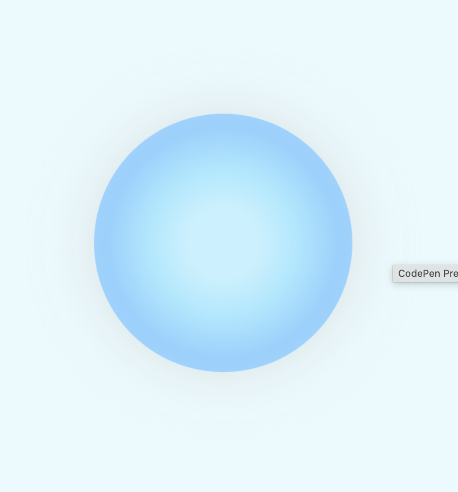

# Css to the rescue process

## Project discription 
I wil de be experimenting with CSS techniques that are new (to me). I will be  creating an innovative, experimental, and enjoyable experience - using only vanilla HTML and vanilla CSS.

## Week 1

### Brainstorming Ideas 
It was time to start brainstorming some ideas. i went with the theme: **Modular Control panel** so it must controll something. 
I am currently very invested in wellness and different things that can help with improving yourself mentally and physically, so i started researching things we can implement in a controll pannel that can help you with "relaxing" and mindfullness practices. 

- Breathwork/ beathing techniques
- Light therapy/ mood lighting
- Sounds
These are all things you could controll with the controllpannel to get yourself in the right mind space.

As you can kind off see in these sketches i want to make a controll pannel where you have different buttons and sliders etc where you can controll the lights and hue of the screens but also press the buttons to get different breathing techniques which i want to annimate with timing. Im still figuring out some extra features but i definetly want to play around and try to find/ do some cool stuff.

### Plan for next week.
For next week i want to focus on the smaller thing. Experement with the smaller parts for that i can put them all toghther at the end.

### Struggles this week
I mostly struggled with really coming up with an idea. i thought too big and learned that i just need to start with smaller things and work my way up to something bigger.

## Week 2

### Breathing Animations
I started with the breathwork animations right away because i thought these were going to be the hardest part. 
I was fairly new to animations: "keyframes". So i needed to do a lot of research. 
i learned about the animation name, duration and iteration count. So i tried them out on the "box breathing" and the "breathing circle" for now.

With the boxbreathing i needed 2 animations at the same time.

.png)
.png)

And the circle just needed a simple animation.

### Plan for next week
For next week i want to start by building the full picture. Like the structure and design elements of the full screen.

### Struggles this week
This week i mostly struggled with how i wanted the last animation to be. I want to design a ball that follows a path but i just couldnt figure out how that was posible yet. 

## Week 3 

### Controls

My sketch and first draft started with 3 buttons, 2 sliders, a toggle and i knew i wanted to do something with radiobuttons so i started with a code and rough design of these elements.

### 3D effect

I played around with the 3D effect in the buttons. This was a fairly easy and a cool way to add more depth in my project. 

### Clip path

I loved experementing with clippath and new shapes i could make and try out. 
I started with some hearts and just some simple things.

But then i was thinking how i can make more shapes and costumize my controll panel even more. So i stared experementing

<!-- toggle button clip path? -->

### States (animations)

### Mid way design

### Plan for next week
I plan to finish the design of the page and some extra elements.
I aslo want to fix the costumproperties
Make 1 one breathwork animation
And ofcourse making everthing work together 

### Struggles this week
I an still struggeling with the design of the radiobuttons
But my main struggles right now is responsiveness. 

